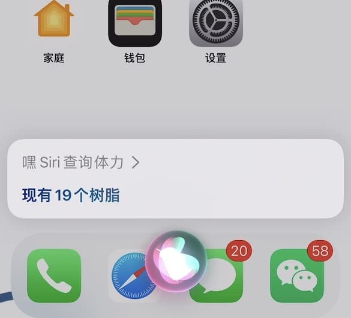
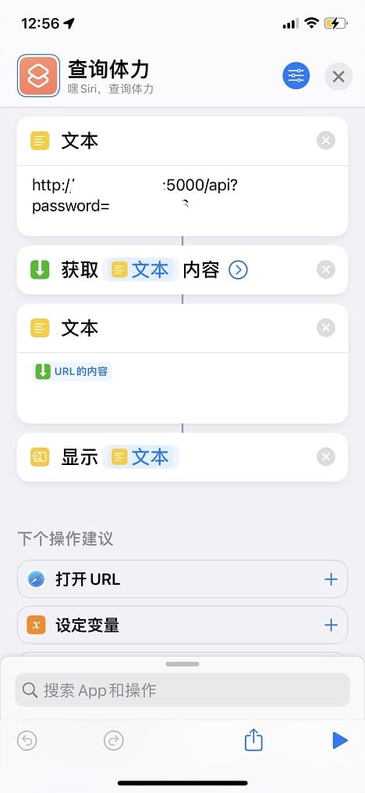

# 原神树脂查询API

通过Siri接入此接口可实现语音查询树脂的量

欢迎pr fork star

**数据获取部分代码来源于：https://github.com/yaomeng0722/genshin_task-resin-expedition_alert**

## 实现效果



## 如何使用
推荐docker运行
1. 克隆本项目
```shell
git clone https://github.com/xwwwb/GenshinResinAlert.git
```
2. 修改配置文件

打开config.json文件

在uid中输入游戏UID

登录米游社 F12打开控制台 输入
```javascript
let domain=document.domain;let cookie=document.cookie;prompt('Cookies: '+domain, cookie)
```
将获得的内容粘贴到cookie中

将 *访问密码* 写入password中
3. 构建镜像
```shell
docker build -t genshinresinalert:1.0 .
```
4. 启动容器
```shell
docker run -d -p 5000:5000 genshinresinalert
```
5. 访问测试

浏览器输入 `您的ip:5000/api?password=您的访问密码`

例如`127.0.0.1:5000/api?password=123123`

6. 接入Siri

按照图示配置快捷指令即可
依次为 `文本` `获取URL内容` `文本` `显示结果`


